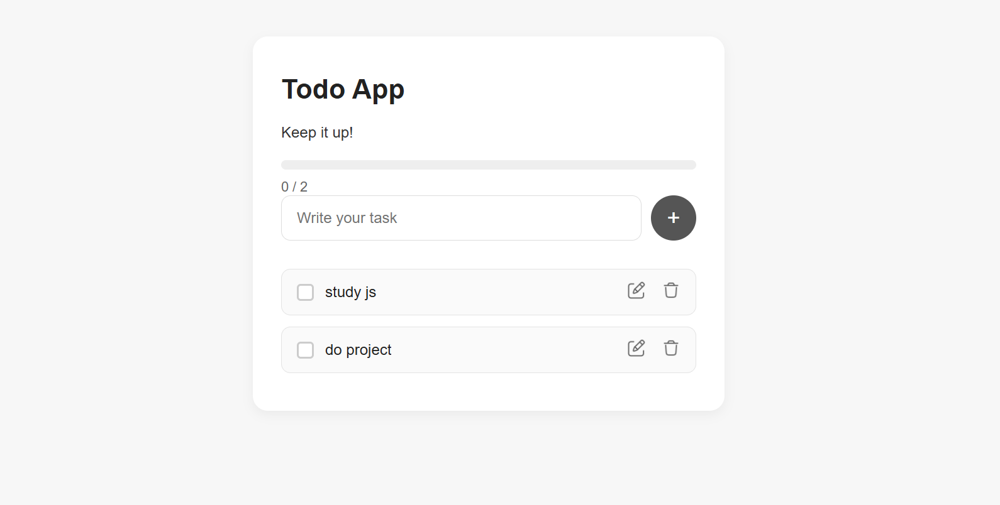
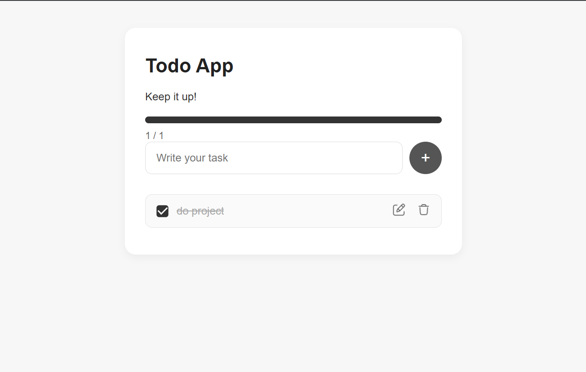

# Todo List App

A simple and modern **Todo List web application** built using **HTML**, **CSS**, and **JavaScript**.  
It allows users to add, edit, delete, and mark tasks as complete. All tasks are saved in the browser using **localStorage**, so your tasks persist even after refreshing or closing the browser.

---

## Features

- Add new tasks  
- Edit existing tasks  
- Delete tasks  
- Mark tasks as completed  
- Automatically saves tasks in localStorage  
- Displays progress and task statistics  
- Responsive design for mobile and desktop  

---

## Technologies Used

- **HTML5** – Structure  
- **CSS3** – Styling and layout  
- **JavaScript (ES6)** – Logic, event handling, and data persistence  

---

## Screenshots

## Running the Project
### 1. Clone or download the repository

  git clone https://github.com/eelut/A2SV_WebTrack_Task1.git

### 2.Navigate to the project folder

 cd A2SV_WebTrack_Task1

### 3.Open with VS Code Live Server (recommended)
 Open the project folder in VS Code.
 Right-click on index.html.
 Select “Open with Live Server”.
 Your browser will open the project and automatically refresh on changes.

